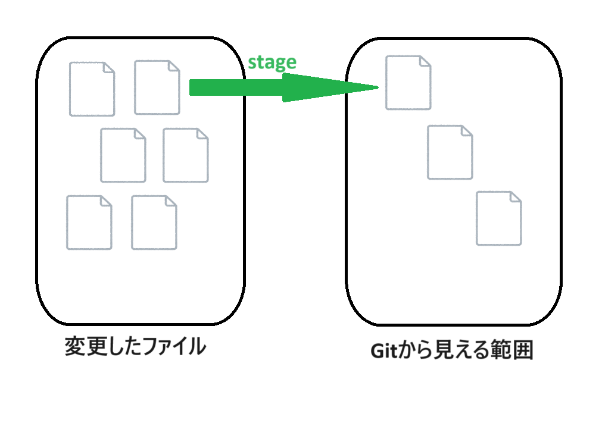
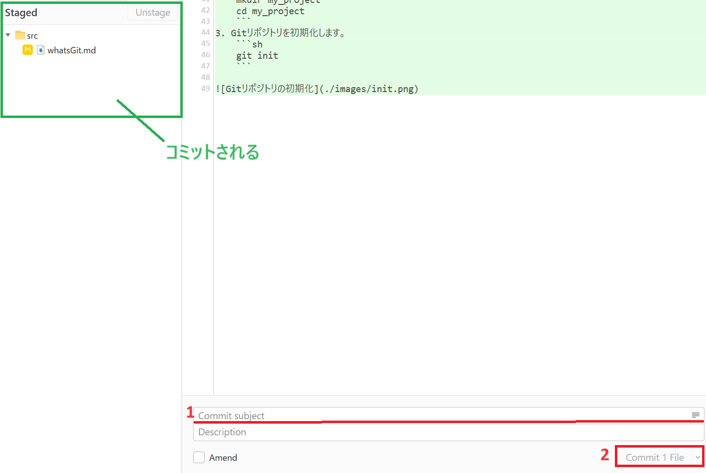
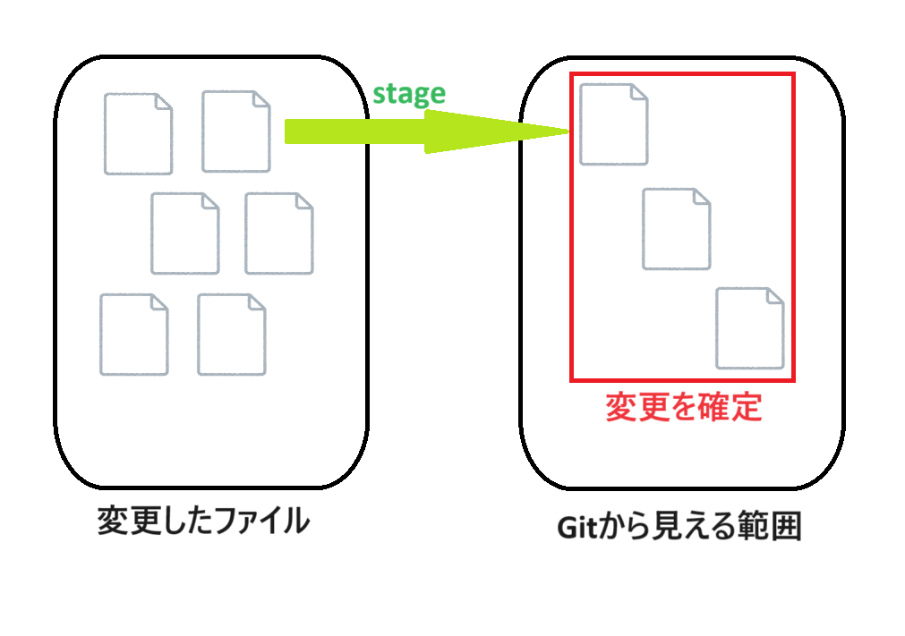

# Gitの基本操作1

## 1. リポジトリのクローン
### Fork
1. `File` > `Clone` を選択します。

2. `Repository Url`にクローンしたいリポジトリのURLを入力します。今回は`https://github.com/tuatmcc/GitLectureRepo.git`を入力してください。


### コマンド
1. GitHubにアクセスし、クローンしたいリポジトリのURLをコピーします。
2. ターミナルまたはコマンドプロンプトを開きます。
3. リポジトリをローカルにクローンします。今回は`https://github.com/tuatmcc/GitLectureRepo.git`を入力してください。
    ```sh
    git clone <クローンしたいリポジトリのURL>
    ```


## 2. ブランチの作成と切り替え
### Fork
1. `Branch`ボタンを押します。

2. `Branch name`に`dev/feature/<GitHubのアカウント名>`を入力します。`<GitHubのアカウント名>`の部分は自分のGitHubのアカウント名に**置き換えてください**。


### コマンド
※`<GitHubのアカウント名>`の部分は自分のGitHubのアカウント名に**置き換えてください**。
1. 新しいブランチを作成します。
    ```sh
    git branch dev/feature/<GitHubのアカウント名>
    ```
2. 作成したブランチに切り替えます。
    ```
    git switch dev/feature/<GitHubのアカウント名>
    ```


## 3. ファイルの追加とステージング
### Fork
1. `Local Changes`を押します。
2. ステージしたいファイルまたはフォルダを選択して`Stage`を押します。(フォルダを選択するとフォルダ内のすべてのファイルがステージされます)\
今回は`VSCode`で適当なファイルを追加してそれを選択してください。


### コマンド
1. プロジェクトディレクトリに新しいファイルを作成します。
    ```sh
    echo "Hello, Git!" > hello.txt
    ```
2. ファイルをステージングエリアに追加します。
    ```sh
    git add hello.txt
    ```


## 4. コミットの作成
### Fork
1. `Commit subject`にコミットのタイトルを入力します。(`Description`にはコミットの説明を入力することができますが、なるべくタイトルで分かるようにしましょう)
2. `Commit * File`を押します。\
このとき`Staged`の下にあるファイルまたはフォルダがコミットされます。


### コマンド
1. ステージングエリアの変更をコミットします。
    ```sh
    git commit -m "コミットメッセージ"
    ```


## 5. リモートリポジトリへのプッシュ
### Fork
1. `Push`を押します。

2. もう一度`Push`を押します。


### コマンド
1. ローカルのコミットをリモートリポジトリにプッシュします。
    ```sh
    git push origin feature/new-feature
    ```


---

この資料では、Gitリポジトリのクローンから始まり、ブランチの作成、ファイルの追加とステージング、コミット、リモートリポジトリへのプッシュまでの基本操作について説明しました。次のステップとして、プルリクエストとマージの操作を学んでいきましょう。
