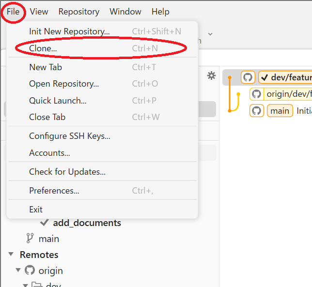
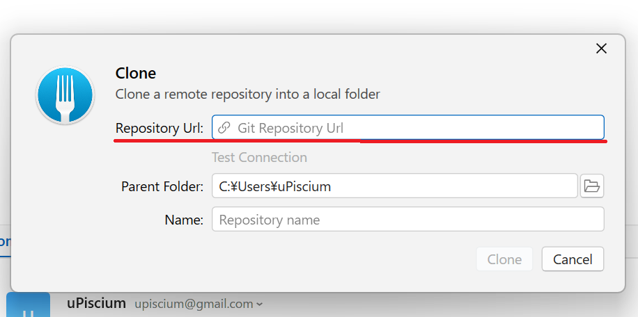
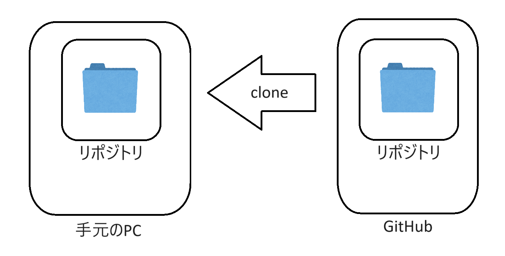

# Gitの基本操作
## リポジトリのクローン
### クローンの概要
- **クローン（clone）** は、リモートリポジトリのコピーをローカルマシンに作成する操作です。
- クローンを行うことで、リポジトリの全履歴、すべてのブランチ、タグ、ファイルがローカル環境に複製されます。

### クローンの利点
- リモートリポジトリと同じ環境をローカルで持つことができ、開発やテストが容易になります。
- ネットワークに接続していなくても、ローカルで作業を続けることができます。
- チーム全員が同じリポジトリの状態から開発を開始できるため、作業の一貫性が保たれます。

### Fork
1. `File` > `Clone` を選択します。

2. `Repository Url`にクローンしたいリポジトリのURLを入力します。今回は`https://github.com/tuatmcc/GitLectureRepo.git`を入力してください。


### コマンド
1. GitHubにアクセスし、クローンしたいリポジトリのURLをコピーします。
2. ターミナルまたはコマンドプロンプトを開きます。
3. リポジトリをローカルにクローンします。今回は`https://github.com/tuatmcc/GitLectureRepo.git`を入力してください。
    ```sh
    git clone <クローンしたいリポジトリのURL>
    ```

