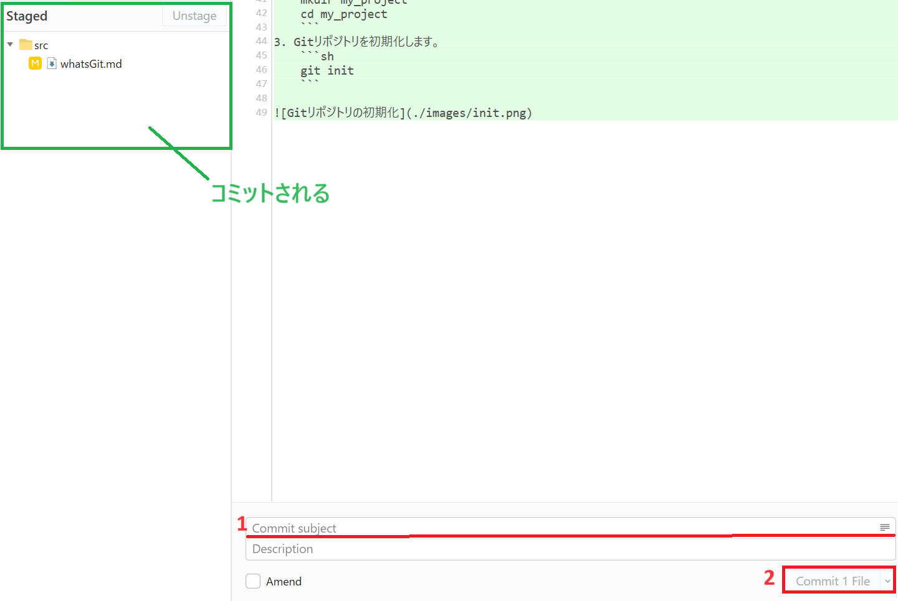
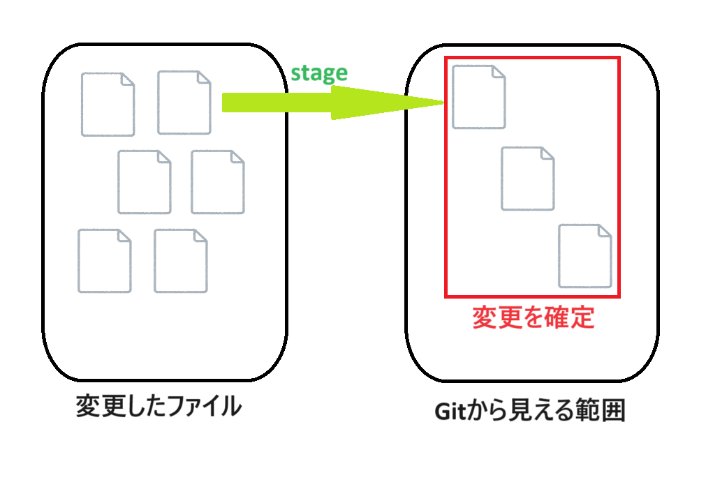

# Gitの基本操作
## コミットの作成
### コミットの概要
- **コミット（commit）** は、ステージングエリアにある変更をリポジトリに記録する操作です。
- 各コミットは、一つのスナップショット（あるいはバージョン）を作成し、プロジェクトの履歴として保存されます。

### コミットの利点
- **変更の追跡**: コミットは、変更の履歴を詳細に追跡します。これにより、誰が、いつ、どのような変更を行ったかを確認できます。
- **バージョン管理**: プロジェクトの特定の状態に戻したり、特定のバージョンを再現したりすることができます。
- **共同作業の管理**: チームメンバーがそれぞれの作業を独立して行い、その結果を統合するための基盤を提供します。

### Fork
1. `Commit subject`にコミットのタイトルを入力します。(`Description`にはコミットの説明を入力することができますが、なるべくタイトルで分かるようにしましょう)
2. `Commit * File`を押します。\
このとき`Staged`の下にあるファイルまたはフォルダがコミットされます。


### コマンド
1. ステージングエリアの変更をコミットします。
    ```sh
    git commit -m "コミットメッセージ"
    ```

