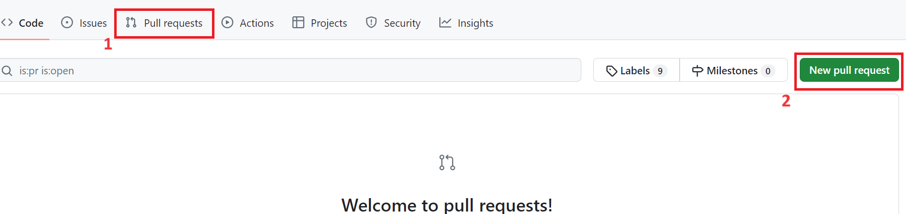
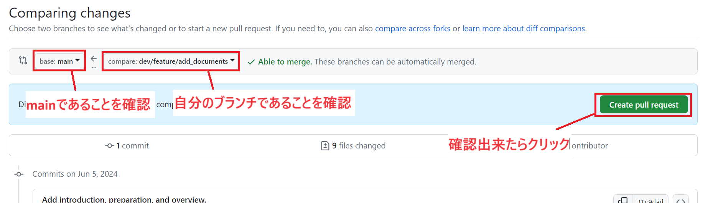
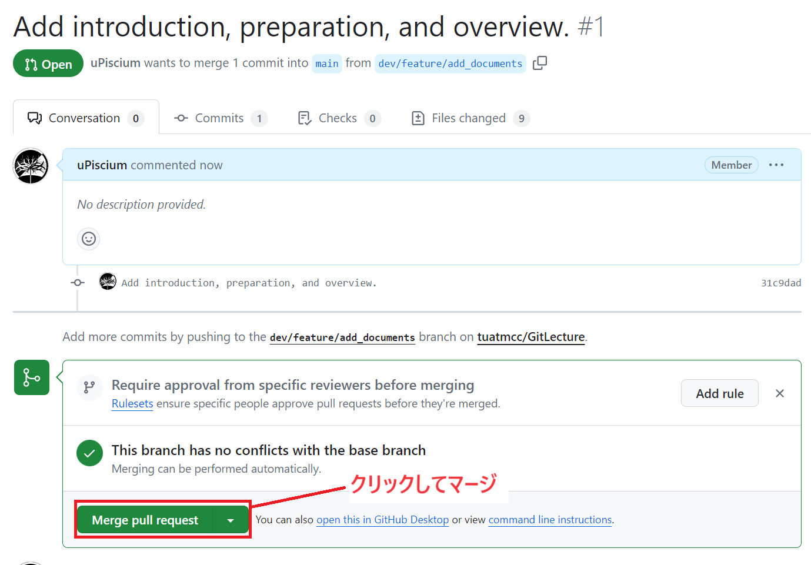
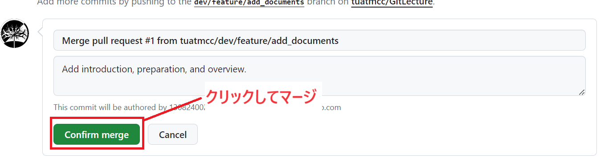

# Gitの基本操作
## Pull Requestの作成 & マージ
ここからの操作は**GitHub**上で行います。

### プルリクエストの概要
- **プルリクエスト（Pull Request）** は、GitHubやGitLabなどのホスティングサービス上で行われる、変更の提案とレビューのプロセスです。
- プルリクエストを通じて、あるブランチで行った変更を別のブランチに統合（マージ）するようリクエストします。

### プルリクエストの利点
- **コードレビュー**: プルリクエストを通じて、他の開発者が変更を確認し、フィードバックを提供できます。
- **品質管理**: プルリクエストは、バグの検出やコード品質の向上に役立ちます。

### マージの概要
- **マージ（merge）** は、別のブランチの変更を現在のブランチに統合する操作です。
- マージを行うことで、複数の開発ラインで行われた変更を一つのブランチに集約します。

### マージの利点
- **変更の統合**: 分散して行われた変更を一つにまとめ、プロジェクト全体の整合性を保つことができます。
- **分散開発の促進**: 複数の開発者が並行して作業し、その結果を容易に統合できます。
- **透明性**: プロジェクト全体で変更内容とその議論を記録として残せます。

### プルリクエストの作成
1. GitHubにアクセスし、対象のリポジトリ(今回は[GitLectureRepo.git](https://github.com/tuatmcc/GitLectureRepo.git))を開きます。
2. リポジトリのトップページで、「Pull requests」タブをクリックします。
3. 「New pull request」ボタンをクリックします。

4. ***base:*** に`main`、***compare:*** に自分の作成したブランチ(`dev/feature/<GitHubのアカウント名>`)が設定されていることを確認します。

5. 変更内容を確認し、必要に応じてコメントを追加します。
6. 「Create pull request」ボタンをクリックしてプルリクエストを作成します。

### マージの方法
1. プルリクエストのページで「Merge pull request」ボタンをクリックします。

2. 「Confirm merge」ボタンをクリックしてマージを完了します。(本来はここで他のプログラマーなどからコードレビューを行ってもらいます)

