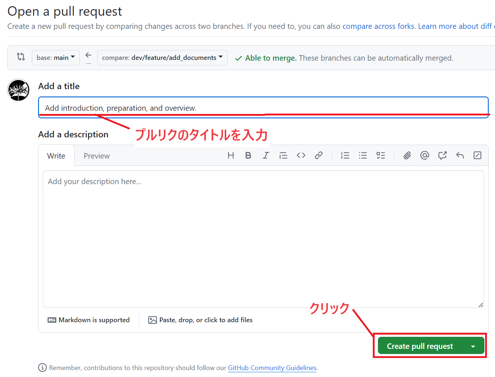

# Pull Requestを用いたMergeの方法

## 1. Pull Requestの概要

### Pull Requestとは
- **Pull Request**（プルリクエスト）は、他の人に自分の変更をレビューしてもらい、リポジトリにマージするためのリクエストです。
- コードレビューを通じて品質を担保し、バグの早期発見や改善提案を行えます。

## 2. Pull Requestの作成 & マージ
ここからの操作は**GitHub**上で行います。

### Pull Requestの作成
1. GitHubにアクセスし、対象のリポジトリ(今回は[GitLectureRepo.git](https://github.com/tuatmcc/GitLectureRepo.git))を開きます。
2. リポジトリのトップページで、「Pull requests」タブをクリックします。
3. 「New pull request」ボタンをクリックします。

4. ***base:***に`main`、***compare***に自分の作成したブランチ(`dev/feature/<GitHubのアカウント名>`)が設定されていることを確認します。

5. 変更内容を確認し、必要に応じてコメントを追加します。
6. 「Create pull request」ボタンをクリックしてプルリクエストを作成します。


### マージの方法
1. プルリクエストのページで「Merge pull request」ボタンをクリックします。

2. 「Confirm merge」ボタンをクリックしてマージを完了します。


## 6. リモートの変更をローカルに反映する (Pull)
### Fork
1. `Pull`を押します。

2. もう一度`Pull`を押します。


### コマンド
1. メインブランチに切り替えます。
    ```sh
    git checkout main
    ```
2. リモートリポジトリの変更をローカルリポジトリに反映します。
    ```sh
    git pull origin main
    ```

### 効果的な図: Pullの操作手順

*注: 画像には以下の内容が含まれます。*
- リモートリポジトリからローカルリポジトリへのpull操作

## 5. ローカルブランチの削除

### 不要なブランチの削除
1. リモートブランチを削除します。
    ```sh
    git push origin --delete feature/new-feature
    ```
2. ローカルブランチを削除します。
    ```sh
    git branch -d feature/new-feature
    ```

---

この章では、Pull Requestを用いたMergeの方法について説明しました。
今回の講習は以上で終了です。お疲れさまでした！
この講習の続きとしてGit演習会を近々開催予定なので今回学んだ知識を利用してより実践的なGitの利用を行ってみたい人はこちらにもぜひご参加ください！
