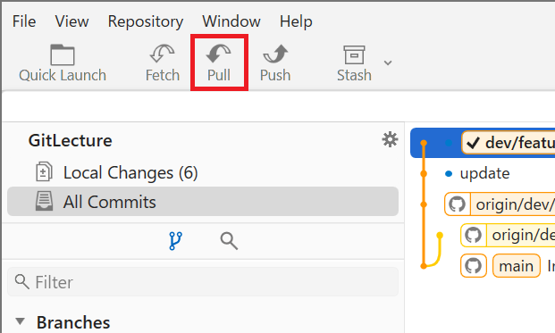
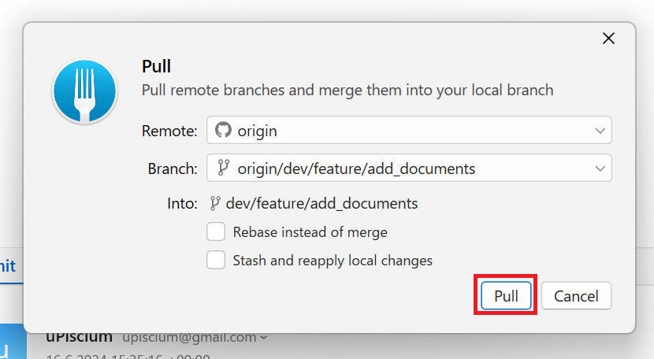

# Gitの基本操作
## リモートの変更をローカルに反映する (Pull)
### プルの概要
- **プル（pull）** は、リモートリポジトリの変更をローカルリポジトリに取り込む操作です。
- プルは、リモートリポジトリから最新のコミットを取得し、ローカルブランチに反映する一連の操作を行います。

### プルの利点
- **最新の状態に更新**: プルを行うことで、リモートリポジトリの最新の変更をローカルリポジトリに取り込むことができます。
- **共同作業の促進**: 他のチームメンバーが行った変更を自分の作業環境に反映させることで、共同作業を円滑に進めることができます。
- **コンフリクトの早期解決**: プルを頻繁に行うことで、他のメンバーの変更とのコンフリクトを早期に検出し、解決することができます。

### Fork
1. `Pull`を押します。

2. もう一度`Pull`を押します。


### コマンド
1. メインブランチに切り替えます。
    ```sh
    git checkout main
    ```
2. リモートリポジトリの変更をローカルリポジトリに反映します。
    ```sh
    git pull origin main
    ```
