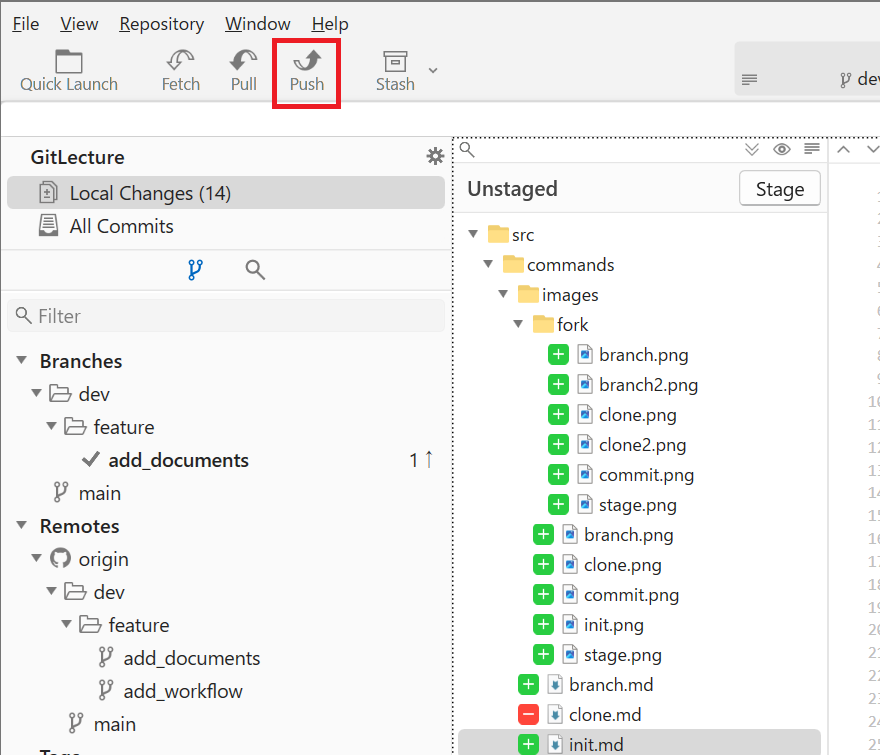
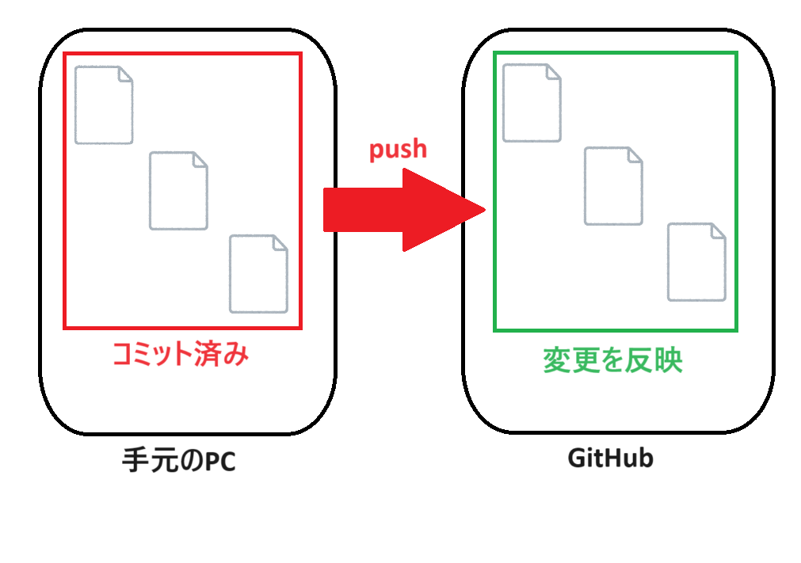

# Gitの基本操作
## リモートリポジトリへのプッシュ
### プッシュの概要
- **プッシュ（push）** は、ローカルリポジトリのコミット履歴をリモートリポジトリに送信し、反映させる操作です。
- プッシュを行うことで、他のチームメンバーと変更内容を共有し、共同開発を進めることができます。

### プッシュの利点
- **変更の共有**: ローカルリポジトリで行った変更をリモートリポジトリに反映し、チーム全員が最新のコードにアクセスできるようになります。
- **共同作業の促進**: プッシュを通じて、複数の開発者が同じリポジトリで並行して作業し、成果物を統合することが容易になります。
- **バックアップの作成**: ローカルの変更をリモートに保存することで、ローカルデータの損失リスクを軽減します。

### Fork
1. `Push`を押します。

2. もう一度`Push`を押します。


### コマンド
1. ローカルのコミットをリモートリポジトリにプッシュします。
    ```sh
    git push origin feature/new-feature
    ```

