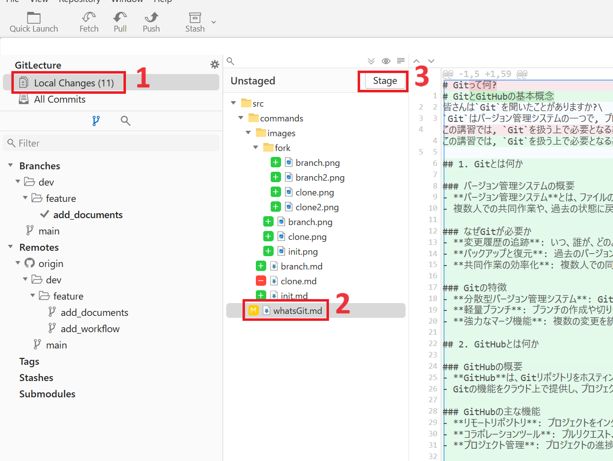
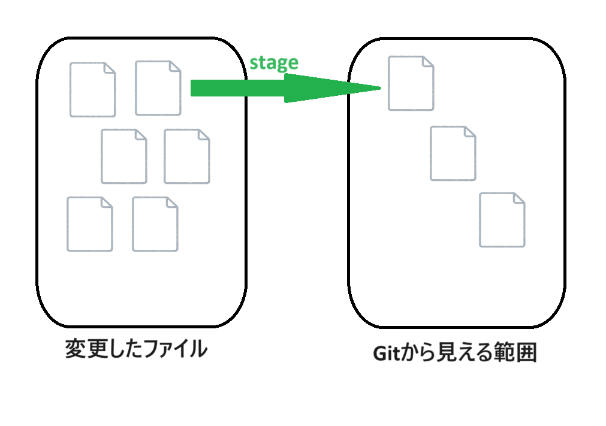

# Gitの基本操作
## ファイルの追加とステージング
### ステージの概要
- **ステージ（stage）** は、Gitにおけるファイルの変更を次のコミットに含めるための一時的な領域です。
- ステージングエリアとも呼ばれ、次に行うコミットにどのファイルが含まれるかを指定する場所です。

### ステージの利点
- **部分的なコミット**: ファイル全体ではなく、特定の変更だけをコミットに含めることができます。
- **コミットの準備**: 複数の変更をまとめてコミットする前に、ステージングエリアで確認できます。
- **変更の管理**: 大規模な変更を小分けにしてコミットする際に便利です

### Fork
1. `Local Changes`を押します。
2. ステージしたいファイルまたはフォルダを選択して`Stage`を押します。(フォルダを選択するとフォルダ内のすべてのファイルがステージされます)\
今回は`VSCode`で適当なファイルを追加してそれを選択してください。


### コマンド
1. プロジェクトディレクトリに新しいファイルを作成します。
    ```sh
    echo "Hello, Git!" > hello.txt
    ```
2. ファイルをステージングエリアに追加します。
    ```sh
    git add hello.txt
    ```

