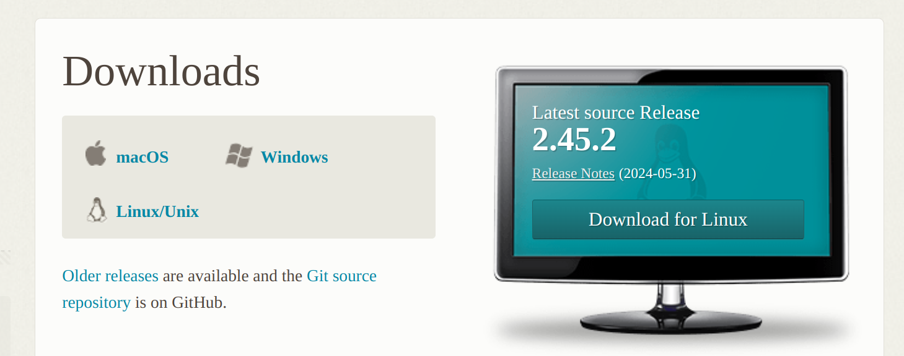

# Gitを使う下準備
まず, Gitを使うために必要な下準備を行います.
1. `GitHub`に登録
2. `Gitクライアント`のインストール
3. `Fork`のインストール

# GitHubに登録
今回はリポジトリの管理に`GitHub`というサイトを利用します. `GitHub`はクラウドベースのGitリポジトリを提供するサービスで無料で利用することができます.\
それでは早速, `GitHub`に登録しましょう!
1. [GitHubのホームページ](https://github.com/)にアクセス
2. 右上の`Sign up`をクリック
3. 指示に従ってメールアドレスやらなんやらを登録
4. 確認コードを入力
5. 完了!

# Gitクライアントのインストール
Gitを使うためには, まずGitクライアントをインストールする必要があります. [Gitのダウンロードページ](https://git-scm.com/downloads)からダウンロードして, ダウンロードしたファイルを開いて指示に従ってインストールしてください.

# Forkのインストール
Gitは本来コマンドを用いて操作を行うものですが, コマンドを最初から扱うのはハードルが高いので, GUIで操作ができる`Fork`というソフトを利用します.\
[Forkのダウンロードページ](https://git-fork.com/)からダウンロードして, ダウンロードしたファイルを開いて指示に従ってインストールしてください. \
(`Linux`を使っている人は残念ながら使えないです... 大人しくCLIで頑張りましょう!)

